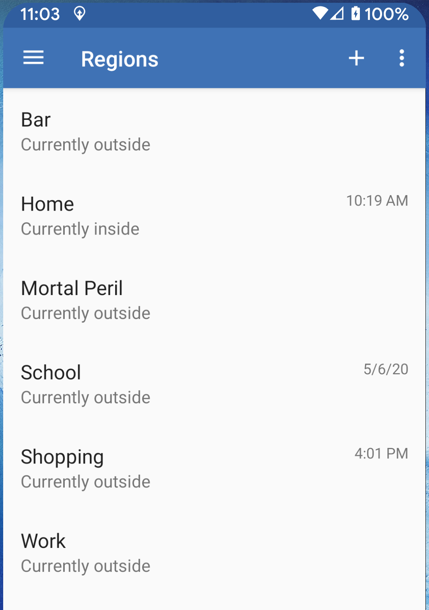

# MMM-WeasleyClock
<br>
A Magic Mirror module for displaying results from [OwnTracks](http://owntracks.org) in a manner similar to the _Harry Potter_ series of movies. This module will parse messages sent from your mobile phone and display your rough location.

This module was inspired by the Instructable [Build Your Own Weasley Location Clock](https://www.instructables.com/id/Build-Your-Own-Weasley-Location-Clock/).

1. [Module Installation](#Installation)
2. [How it Works](#Architecture)
3. [Configuring the Module](#Configuration)
4. [Table Mode](#Alternate)
5. [Installing OwnTracks on Your Phone](#Owntracks)
6. [Adding Locations to Your Phone](#regions)
7. [If You Want to Use Your Own MQTT Server](#development)
7. [Upcoming Features](#todo)

## Installation
Installation of the Magic Mirror module is similar to all other modules:
```
cd /home/pi/MagicMirror/modules
git clone https://github.com/BrianHepler/MMM-WeasleyClock
cd MMM-WeasleyClock
npm install
```
Modify your `config.js` file to include the module.
```
{
    module: "MMM-WeasleyClock",
    position: "middle_center",
    config: {
        uniqueId: "demo",
        locations: {"School", "Work", "Jail", "Mortal Peril", "Bar", "Traveling", "Home"},
        people: ["Harry","Ron","Hermione"],
    },
},
```

<br>
### Dependencies
* A working installation of [Magic Mirror](https://github.com/MichMich/MagicMirror)
* `mqtt` to connect to the mosquitto message broker (loaded via npm)
* `svg.js` to draw the clock (loaded via npm)
* `Howler` to play the sound file (loaded via npm)

## Architecture
The basic operational flow goes like this:
* The OwnTracks mobile app uses your phone's location services to figure out 
where you are and if you are in a defined area. 
* The app securely publishes a small message to a MQTT server with that information.
* The module securely subscribes to that same server and reads the messages as they arrvie.
* The module matches the fields in the message to the configured people & locations and updates accordingly.

I am hosting an MQTT server for this module at weasleymirror.duckdns.org. You are welcome to set up your own server or use mine. I can't see your messages, but I can see if you connect successfully.

<a href="#modconfig"></a>
## Configuration 
Your configuration needs to contain a unique identifier that will separate your module from all of the other modules (namely mine). This unique ID will be entered both in the module and OwnTracks app on your phone. If you do not 
enter a unique ID, everyone who uses the same ID will be able to see your movements.
```
{
    module: "MMM-WeasleyClock",
    position: "middle_center",
    config: {
        uniqueId: "CowboysDude",
        locations: {"School", "Work", "Jail", "Mortal Peril", "Bar", "Traveling", "Home"},
        people: ["Cowboy","Cowgirl","Rustler"],
    },
},
```
See the [full list of options](#configoptions).

## Installation on Your Phone
OwnTracks is a free (as in beer) application for your mobile phone. Go to the Google Play Store or the iTunes store and search for OwnTracks. Install the app and then open it, just like you were installing Candy Crush.

On your computer, download the included certificate `weasley_mirror_ca.crt` from this repository and email it to yourself (or copy the file to your phone over USB).

Once the app is open, click on the menu in the upper left and select Preferences at the bottom.<br> 

Press the Connect option and then configure the connection Mode to use MQTT.
<br><br>
Configure the Host menu with the following values. Host=`weasleymirror.duckdns.org`, Port=`8883`. Do not use websockets.
<br><br>
Configure the Identification with values unique to you. The fields in the OwnTracks app do not exactly match up to the module's terminology. So here is what you put in each field:
* `Username` = Your unique ID from the module configuration. Any alphanumeric string, may not contain spaces.
* `Password` = Make up a password. It doesn't matter.
* `Device ID` = The name of the person using this phone. A single word, no spaces. This must match one of the entries in the `people` array in your module configuration.
* `Tracker ID` = A two-character identifier. Can be any 2 alphanumeric characters.

<br><br>
Configure the app security by giving it the certificate file that you emailed to yourself. First, click on the file attachment to download it to your phone.
<br><br>
Once the cert is downloaded, specify the cert in the security configuration. You will be able to pick the file from your phone's file system here. You should leave the last two fields blank.
<br><br>
Finally, configure the client to use a clean session. (basically, have no memory of previous connections)<br>
<br>
Once everything is complete, you can go back to the Preferences menu and click on the Status menu item and see Connected at the top.<br>


Whew! At this point, you are connected to my MQTT server, but your phone doesn't know anything about the locations you specified in the `config.js`. Specifying a location in OwnTracks is currently rather cumbersome, but it's worth it when you're done.

You need to create Regions in OwnTracks that match to the locations you wish to display in your Weasley Clock. 

### Adding Regions to OwnTracks
In order for the module to work, the OwnTracks app will need to know the location of each location you're displaying in the module. So you'll need:
- The list of locations that you configured for your mirror.
- The longitude & latitude for each of those locations.

Note: The locations can be different for each phone. For example, my wife and I both have "Work" configured on our phones, but we have different long/lat configured. As our respect phones enter the different regions, they each report that we have entered "Work" to the mirror.

In the OwnTracks app, opent he menu and click on Regions. Click on the "+" button to add a new region. Enter the name of the location and the longitude & latitude. Add a radius to define the area that the phone will consider to be that location. 250 meters is a good starting point.
<br> 

### Alternate
<br>
If you wish to have a compact representation of the OwnTracks data, you can switch the display to a simple two-column table. It contains a list of the defined people and their interpreted location. This is good for smaller areas of the Magic Mirror interface. Table mode also will not play sounds when locations update.

<a href="#configoptions"></a>
## Configuration Options (Module)
These are the options to configure the module. Configuring the OwnTracks application will be handled below.

<table>
<tr><th>Option</th><th>Description</th></tr>
<tr><td><b>uniqueId</b></td>
    <td><b>Description: </b>The unique identifier shared between your instance of the MMM-WeasleyClock module and your OwnTracks apps.
        <br><b>Default: </b>"notunique"
        <br>Note: Leaving this unchanged will allow everyone else with this module to see your locations.
    </td>
</tr>
<tr><td><b>Locations</b></td>
    <td><b>Description: </b>An array of location names. These are the possible locations that the module will display. They must match the names of the regions you define in the OwnTracks application. (Capitalization is important!)
        <br><b>Default: </b>["Home","School","Work","Mortal Peril","Jail","Food"]
        <br><b>Note</b>: There are two additional locations that are reserved: "Traveling" and "Lost". They will be included automatically.
    </td>
</tr>
<tr><td><b>People</b></td>
    <td><b>Description: </b>An Array of people names. Each one will be represented by a hand on the clock (or a row in the table). Each OwnTracks app must be configured with one of these names. (Capitalization is important!)
        <br><b>Default: </b>["Harry","Ron","Ginny"]
    </td>
</tr>
<tr><td><b>colorCycle</b></td>
    <td><b>Description: </b>An array of color names that will be used for the hands.
        <br><b>Default: </b>["blue","green","yellow","purple","red","white","gray"]
    </td>
</tr>
<tr><td><b>radius</b></td>
    <td><b>Description: </b>The radius of the circle that defines the positioning of the locations around a central point. Adjust this to tighten up or expand your clock size.
        <br><b>Default: </b>85
        <br><b>Note: </b>Has no effect on the table display.
    </td>
</tr>
<tr><td><b>hubDisplacement</b></td>
    <td><b>Description: </b>The space between the center point and the beginning of each hand.
        <br><b>Default: </b>5
    </td>
</tr>
<tr><td><b>clockStyle</b></td>
    <td><b>Description: </b>Controls the overall look of the module. Possible values are <b>"clock"</b> and <b>"table"</b>.
        <br><b>Default: </b>clock
    </td>
</tr>
<tr><td><b>sounds</b></td>
    <td><b>Description: </b>Turns on or off the sound that plays when the hands move position. Sound does not play in table mode.
        <br><b>Default: </b>true
    </td>
</tr>
<tr><td><b>debug</b></td>
    <td><b>Description: </b>Turns on verbose logging in both the browser console and the node console. Warning: I'm a bit verbose.
        <br><b>Default: </b>false
    </td>
</tr>
<tr><td><b>host</b></td>
    <td><b>Description: </b>The URL of the MQTT server (aka, the message broker). This is where the module will listen for messages from OwnTracks.
        <br><b>Default: </b>weasleymirror.duckdns.org
        <br><b>Note:</b> The module defaults to using TLS security. If you change this value, you will also have to provide your own certificates.
    </td>
</tr>
<tr><td><b>cafile</b></td>
    <td><b>Description: </b>The name of the Certificate Authority cert used to authorize TLS connections to the MQTT server. If that is too many acronyms for you, don't change it.
        <br><b>Default: </b>weasley_mirror_ca.crt
    </td>
</tr>
<tr><td><b>port</b></td>
    <td><b>Description: </b>The network port used to connect to the MQTT server.
        <br><b>Default: </b>8883
    </td>
</tr>
</table>

## OwnTracks
Owntracks is a free mobile app that will track your location and send updates to a MQTT server. Here is how you configure the mobile app to work with my MQTT server. First, you will need to get my Certificate Authority cert onto your phone. The easiest way to do this is to email yourself and include the cert as an attachment. The cert is included in the Github repository and is named `weasley_mirror_ca.crt`. 

All of these steps are to be taken on your mobile phone.

* Install the Owntracks app from the Google Play Store or the iTunes Store
* Open the app, go through the introduction, open the menu (three horizontal lines in the upper left hand corner) and then go to Preferences
* Click on Connection
* CLick on Mode. Select `Private MQTT`. Accept
* Click on Host. Enter `weasleymirror.duckdns.org` for Host, `8883` for port, no websockets
* Click on Identification. Enter your Unique ID in the username. This is what identifies your messages as belonging to you. It must match the value of the `uniqueId` parameter in your module config. **Every mobile device that you set up must use the same uniqueId in the username field**. This will let you keep your location data separate from everyone else.
* Enter your name in the Device ID field. This should be one of the entries in the *people* array from your module configuration. This lets the module tell your mobile devices apart from each other.
* Enter a two-letter identifier in Tracker ID field. This value does not make a difference, but OwnTracks requires it.
* Select Parameters. Make sure Clean Session is ON.
* Go back to Preferences. Go to Reporting and turn on extended reporting.

Just FYI - Owntracks mobile app will automatically publish to "owntracks/*uniqueId*/deviceId"

## Regions
Regions = Locations in your module configuration. The way this works is that when your cell phone/table enters a defined region, it publishes a notification to the MQTT server. To get it to work, you have to define what regions correspond to what name.

Start with the list of locations that you defined in the `locations` parameter in the module configuration. "School", "Home", "Mortal Peril", etc. 
* In the mobile application, click on the menu icon (the three horizontal lines) and then select "Regions". 
* Click on the plus (+) icon to create a new region. 
* Give your region one of the names in your location array. Spelling and capitalization are important!
* Click on the crosshairs icon in the upper right to go to the location selection screen. Either use the search bar at the top to find an address, or drag the screen around to find the correct location.
* Click on the "Use this location" button to finalize the location on the planet for your region.
* Add a radius in the last field of the region. 250 meters is pretty good.
* Click on the check mark icon at the top to save your region.

Do this for each region that you wish to use. It is important to note that each region can be defined differently for each device. For example, you and your spouse can have different regions called "Work".

Note: Two names are reserved by the module: Traveling and Lost.

## Development
I've written up some advice to help over at the [Developer's Notes](developmentnotes.md). I've also included some debugging tips.

## ToDo
* Better graphics for the clock, including backgrounds and fancy hands
* Third style of display, using [Flapper](https://github.com/jayKayEss/Flapper)
* Add language translations for "Traveling" and "Lost"
* Selectable sounds for when the locations of people update
* ~~Get the fancy font to work~~
* Move installation instructions to the module Wiki